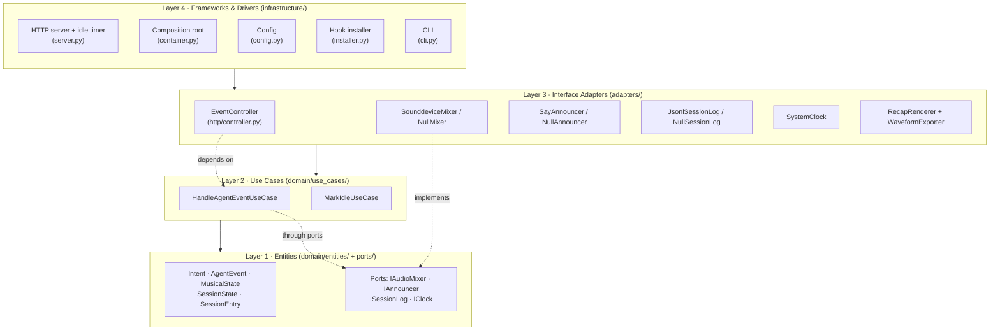
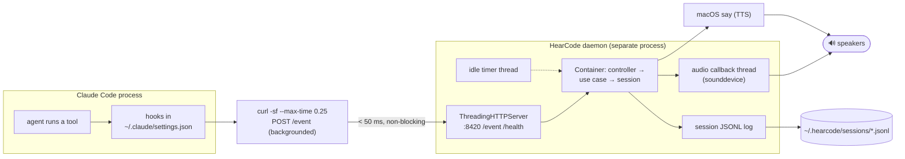
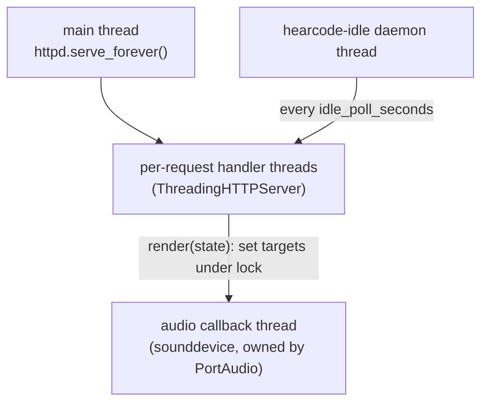
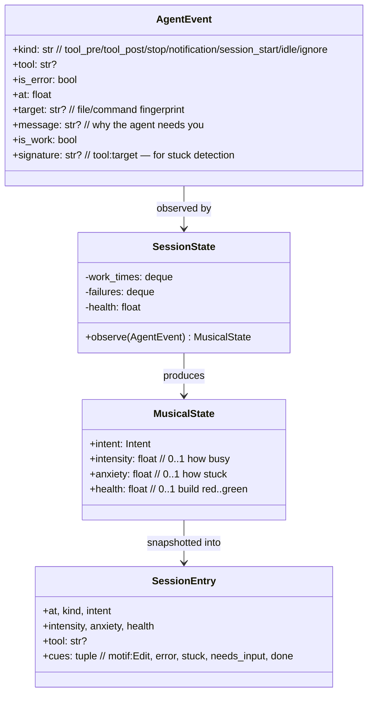
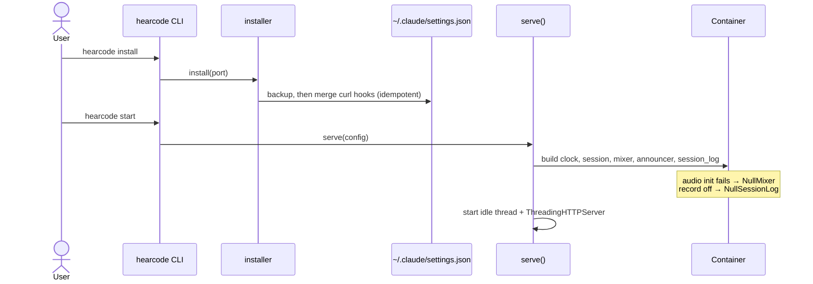
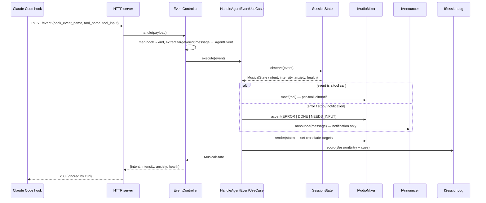
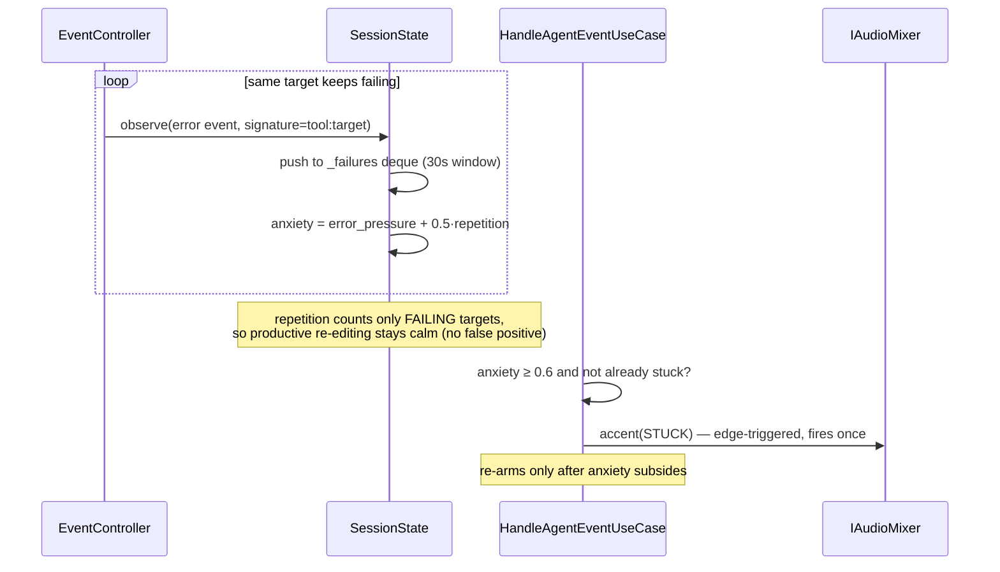
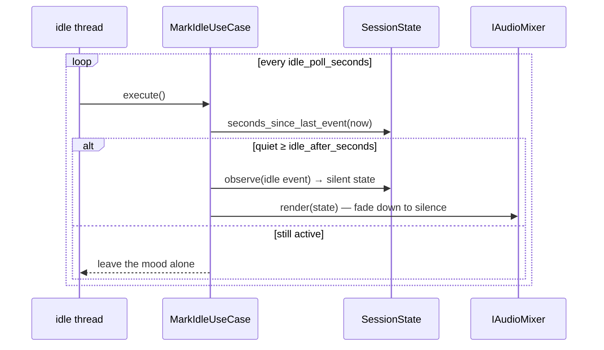

# HearCode — Architecture

HearCode gives a coding agent (Claude Code first) a **live, adaptive soundtrack**:
while the agent works, music plays that reflects *what* it is doing (exploring,
building, running commands), *how hard* it is working, whether it is *stuck*, and
whether the *build is green or red* — plus spoken alerts when it needs you. A
session can be replayed afterward as an audio recap and a shareable waveform
poster.

This document captures the structure, the layering, the runtime topology, the
data that flows through, and the main execution sequences.

---

## 1. Design approach: Clean Architecture

The codebase follows Robert C. Martin's Clean Architecture. The guiding rule is
the **Dependency Rule**: source-code dependencies point only *inward*. The domain
(the musical reasoning) knows nothing about HTTP, audio devices, files, or Claude
Code's hook JSON — those are all outer-layer details that depend inward through
**ports** (abstract interfaces) and **adapters** (concrete implementations).



**Why this matters here:** the rule that "an `Edit` tool means a *building* mood"
is enterprise policy and lives in `Intent.classify`. Whether that mood becomes
sounddevice gains, a logged line, or nothing at all is an adapter choice. Swapping
the audio engine (e.g. to Web Audio) or the transport (e.g. to a Unix socket)
touches only the outer layers; the domain is untouched.

### Layer-by-layer file map

| Layer | Directory | Key modules | Responsibility |
|-------|-----------|-------------|----------------|
| 1 — Entities | `domain/entities/`, `domain/ports/` | `intent`, `events`, `musical_state`, `session`, `session_entry`; port ABCs | Pure musical reasoning + the abstract boundaries. Stdlib only, fully unit-testable. |
| 2 — Use Cases | `domain/use_cases/` | `handle_event`, `mark_idle` | Orchestrate one user intention by driving the session entity through the ports. |
| 3 — Adapters | `adapters/` | `http/controller`, `mixer/*`, `announcer/*`, `session_log/*`, `clock/*`, `recap/*` | Translate between the outside world and the domain. Humble Objects: no policy. |
| 4 — Frameworks | `infrastructure/` | `server`, `container`, `config`, `installer`, `cli` | Wire concretes together, own the HTTP framework, env, and process lifecycle. |

**Null Object pattern** appears in every output port (`NullMixer`,
`NullAnnouncer`, `NullSessionLog`) so the system degrades gracefully: no audio
device, headless box, or `HEARCODE_RECORD=0` all run unchanged with a no-op
adapter swapped in at the composition root.

---

## 2. Runtime topology

HearCode runs as a **long-lived local daemon**, decoupled from the agent. Claude
Code's hooks fire a fire-and-forget `curl` per event; the daemon does all the
heavy audio work out of band so the agent is never slowed.



**Latency guarantee:** the hook command is `curl … --max-time 0.25 || true`. If
the daemon is down, a refused localhost connection fails instantly; if it is up,
the POST returns in well under 50 ms because the handler only folds one event and
returns a tiny JSON status — the audio is rendered asynchronously in the
sounddevice callback thread.

### Process / thread model inside the daemon



The mixer shares gain/target/position state behind a `threading.Lock`. Request
threads write *target* gains; the audio callback glides *current* gains toward
them per block, producing crossfades. The idle thread polls and, after
`idle_after_seconds` of silence, pushes an `idle` event that decays the mix.

---

## 3. Core data model

Three immutable value objects carry everything through the system; one mutable
entity (`SessionState`) holds the rolling memory.



### The four musical dimensions

The domain reduces every event to a `MusicalState` with four independent knobs;
the arrangement adapter renders them onto seven looping stems plus one-shot
accents.

| Dimension | Domain source | Heard as |
|-----------|---------------|----------|
| **intent** (what) | `Intent.classify(event)` — tool family | which stems play (pad/bass/drums/lead/tension) |
| **intensity** (how busy) | work-event rate over a rolling window | how loud the rhythmic groove is |
| **anxiety** (stuck) | recent *failures* + same-target repetition | a dissonant tension drone bleeds in; a one-shot alert fires |
| **health** (build) | pass/fail of test/build/lint commands | bright (major) vs dark (minor) harmony overlay |

Plus **transient cues** layered over the mood: per-tool leitmotifs on every tool
call, an error sting, a resolve chord on `Stop`, a stuck alert, and a spoken
"needs you" announcement.

---

## 4. Execution sequences

### 4.1 Install & bootstrap



The composition root (`Container`) is the **only** place that imports concrete
classes. Each `_build_*` method picks a real adapter or its Null fallback based on
`Config` and the platform.

### 4.2 Live event → adaptive music (the hot path)



`render()` only *sets target gains*; the audio thread does the actual crossfade.
Unmodeled lifecycle events map to kind `ignore` and return early — no render, no
record, idle timer untouched.

### 4.3 Stuck-loop detection (anxiety)



A key correctness property: anxiety is driven **only by failures**, not by any
repetition. Editing the same file four times productively stays at anxiety ≈ 0;
the same test failing four times escalates fastest.

### 4.4 "Agent needs you" alert

```mermaid
sequenceDiagram
    participant Hook as Notification/PermissionRequest/Denied/Elicitation
    participant Ctrl as EventController
    participant UC as HandleAgentEventUseCase
    participant Mix as IAudioMixer
    participant Ann as SayAnnouncer

    Hook->>Ctrl: POST /event
    Ctrl->>Ctrl: kind=notification; synthesize message ("Claude needs permission to use Bash")
    Ctrl->>UC: execute(event)
    UC->>Mix: accent(NEEDS_INPUT) — unmissable chime
    UC->>Ann: announce(message) — macOS `say`, debounced 4s
```

### 4.5 Idle decay (timer-driven)



On `Stop` the soundtrack already falls silent immediately (the resolve accent
carries the ending), so there is no post-turn ambient bed. Idle and done emit no
continuous stems at all — the music returns the instant the next activity arrives.

### 4.6 Soundtrack recap + waveform export (offline)

```mermaid
sequenceDiagram
    actor User
    participant CLI as hearcode recap
    participant Loader as load_session/latest_session
    participant Stats as session_stats
    participant Rend as RecapRenderer
    participant Wave as WaveformExporter

    User->>CLI: hearcode recap [--seconds N]
    CLI->>Loader: read latest ~/.hearcode/sessions/*.jsonl
    CLI->>Stats: summarise moods/tools/cues → printed recap
    CLI->>Rend: mix_for(entries, seconds)
    Note over Rend: shared arrangement.gains_for + cue_sample;<br/>time-compress timeline, glide gains block by block
    Rend-->>CLI: (mix, schedule)
    CLI->>Rend: write_wav(*.recap.wav)
    CLI->>Wave: export(mix, schedule, *.recap.svg)
    Note over Wave: peak envelope coloured by intent,<br/>alert glyphs, stats subtitle — pure SVG text
```

The live mixer and the offline recap **share the `arrangement` module** (stem
gains + cue→sample mapping, no audio-device import), so a recap is a faithful
fast-forward of what was actually heard — never a separate remix. `mix_for()`
renders once and both the WAV and the SVG consume the same mix + schedule.

---

## 5. Output artifacts & configuration

| Artifact | Default location |
|----------|------------------|
| Session timeline | `~/.hearcode/sessions/<timestamp>.jsonl` (one file per session) |
| Audio recap | `~/.hearcode/sessions/<timestamp>.recap.wav` |
| Waveform poster | `~/.hearcode/sessions/<timestamp>.recap.svg` |
| Stem assets | `assets/loops/*.wav` (synthesized by `tools/gen_stems.py`) |

**Config** (`infrastructure/config.py`, all env-overridable) is the single place
that reads the environment: `HEARCODE_PORT`, `HEARCODE_SILENT`, `HEARCODE_LEITMOTIFS`,
`HEARCODE_ANNOUNCE`, `HEARCODE_VOICE`, `HEARCODE_RECORD`.

---

## 6. Extension points (ports → swap an adapter)

Because every boundary is a port, these are drop-in replacements that leave the
domain untouched:

| Port | Today | Swap in… |
|------|-------|----------|
| `IAudioMixer` | `SounddeviceMixer` / `NullMixer` | Web Audio engine, a different stem pack, a generative synth |
| `IAnnouncer` | `SayAnnouncer` (macOS) / `NullAnnouncer` | Linux `espeak`, a desktop-notification announcer |
| `ISessionLog` | `JsonlSessionLog` / `NullSessionLog` | SQLite, a cloud sink for shareable recaps |
| `IClock` | `SystemClock` | a fake clock (deterministic tests) |
| transport | stdlib HTTP + curl hooks | Unix socket, the hook `http` handler type |

---

## 7. Module dependency summary

```
infrastructure/  ──uses──▶  adapters/  ──uses──▶  domain/use_cases/  ──uses──▶  domain/entities/ + domain/ports/
   (server, container,        (controller, mixer,    (handle_event,                (Intent, AgentEvent,
    config, installer, cli)    announcer, log,         mark_idle)                    MusicalState, SessionState,
                               clock, recap)                                         SessionEntry; port ABCs)

         arrangement.py  ◀── shared by ──▶  sounddevice_mixer.py  &  recap/recap_renderer.py + waveform_export.py
```

Every arrow points inward. Nothing in `domain/` imports `adapters/` or
`infrastructure/`; the only place the concrete graph is assembled is
`infrastructure/container.py`.
